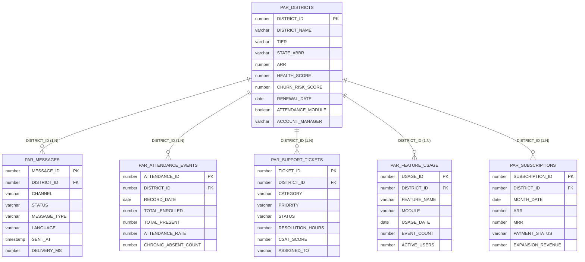

# PAR — ParentSquare Intelligence Demo

A complete Snowflake Intelligence demo for ParentSquare — K-12 family engagement SaaS analytics powered by a Cortex Agent, Semantic View, and Cortex Search over real PDF documents.

---

## What This Demo Shows

ParentSquare is a K-12 communications platform serving 22M+ students. This demo simulates what their internal analytics platform could look like on Snowflake — enabling self-serve analytics for district health, revenue, and engagement using Snowflake Intelligence.

| Layer | What it demonstrates |
|-------|---------------------|
| Cortex Agent (`PAR_AGENT`) | Natural language over structured + unstructured data |
| Semantic View | Governed, AI-ready data model over 6 source tables |
| Cortex Search | PDF document search — CS playbooks + KB articles |
| Synthetic Data | 2M+ rows across 5 source systems (HubSpot, MySQL, Zendesk, Pendo, Billing) |

---

## Quick Start

Complete Steps 1 and 2 and the demo is fully deployed.

### Step 1: Create a Git API Integration & Connect Your Workspace

1. Navigate to **Projects → Workspaces** in Snowsight.
2. Open a blank SQL file and run as `ACCOUNTADMIN`:

```sql
USE ROLE ACCOUNTADMIN;

CREATE API INTEGRATION IF NOT EXISTS GIT_HUB_INTEGRATION
  API_PROVIDER = git_https_api
  API_ALLOWED_PREFIXES = ('https://github.com/')
  ENABLED = TRUE;
```

3. At the top of the left-hand file pane, click the dropdown arrow next to your workspace name.
4. Select **From Git repository** and fill in:
   - Repository URL: `https://github.com/sfc-gh-timjones/c_par`
   - Workspace name: `PAR Demo`
   - API integration: `GIT_HUB_INTEGRATION`
   - Repository access: **Public repository**
5. Click **Create**.

### Step 2: Deploy the Demo Environment

| Script | What it does |
|--------|--------------|
| `sql/TEARDOWN_AND_REBUILD.sql` | Tears down existing objects, runs all setup scripts (01–09). After this, open Snowflake Intelligence and start the `PAR Assistant`. |

### Step 3: Access the Agent

Navigate to **Snowflake Intelligence** in Snowsight → Select **PAR Assistant**.

---

## Project Structure

| Path | Description | Order |
|------|-------------|-------|
| `sql/01_database_and_schema.sql` | Schema, warehouse (`PAR_WH`), cross-region setting | 1 |
| `sql/02_create_tables.sql` | 10 core tables representing 5 source systems | 2 |
| `sql/03_generate_synthetic_data.sql` | Synthetic data: 500 districts, 2M messages, 50K tickets | 3 |
| `sql/04_generate_contacts_faker.sql` | Faker-generated district contacts with realistic names | 4 |
| `sql/05_create_views.sql` | 5 analytical cross-system views | 5 |
| `sql/06_create_semantic_view.sql` | Semantic view with 6 entities, 8 VQRs | 6 |
| `sql/07_create_cortex_search.sql` | 2 Cortex Search services backed by 5 parsed PDFs | 7 |
| `sql/08_create_email_proc.sql` | Email notification procedure | 8 |
| `sql/09_create_agent.sql` | Agent creation with 5 tools | 9 |

---

## Data Sources (Simulated)

| Source System | Domain | Key Tables |
|---|---|---|
| **HubSpot** | CRM | PAR_DISTRICTS, PAR_CONTACTS |
| **MySQL Product DB** | Core Application | PAR_MESSAGES, PAR_ATTENDANCE_EVENTS |
| **Zendesk** | Customer Support | PAR_SUPPORT_TICKETS |
| **Pendo** | Product Analytics | PAR_FEATURE_USAGE |
| **Internal Billing** | Revenue | PAR_SUBSCRIPTIONS |

---

## Agent Tools

| Tool | Type | Purpose |
|---|---|---|
| **ParAnalyst** | cortex_analyst_text_to_sql | Natural language to SQL over all structured data |
| **PlaybookSearch** | cortex_search | CS playbook, QBR guides, churn handling, expansion strategies |
| **KBSearch** | cortex_search | FERPA/COPPA compliance, feature documentation, IT integration guides |
| **SendEmail** | procedure | Send HTML email reports and alerts |
| **data_to_chart** | data_to_chart | Render charts from query results |

---

## Architecture

```
Data Sources (simulated)
  ├── HubSpot (Fivetran)         → PAR_DISTRICTS, PAR_CONTACTS
  ├── MySQL Product DB (dbt CDC) → PAR_MESSAGES (2M rows), PAR_ATTENDANCE_EVENTS (550K rows)
  ├── Zendesk (Fivetran)         → PAR_SUPPORT_TICKETS (50K rows)
  ├── Pendo (Fivetran)           → PAR_FEATURE_USAGE (500K rows)
  └── Billing System             → PAR_SUBSCRIPTIONS (12K rows)
          ↓
  Analytical Views (5 cross-system views)
          ↓
  PAR_SEMANTIC_VIEW (Cortex Analyst)
  PAR_PLAYBOOK_SEARCH | PAR_KB_SEARCH (Cortex Search — 5 PDFs)
          ↓
  PAR_AGENT (Snowflake Intelligence)
```

---

## Demo Questions (by category)

### District Health & Churn Risk
- "Which districts are at highest churn risk and renewing in the next 90 days?"
  - *`PAR_DISTRICTS` (CHURN_RISK_SCORE, RENEWAL_DATE, HEALTH_SCORE, ARR, ACCOUNT_MANAGER)*
- "Show me all districts with health scores below 60"
  - *`PAR_DISTRICTS` (HEALTH_SCORE, TIER, STATE_ABBR, ARR)*
- "Which districts have family engagement scores below 50?"
  - *`PAR_DISTRICTS` (FAMILY_ENGAGEMENT_SCORE, CONTACTABILITY_SCORE, PRODUCTS_COUNT)*
- "Who are the top 10 districts by ARR?"
  - *`PAR_DISTRICTS` (ARR, TIER, HEALTH_SCORE, RENEWAL_DATE)*
- "Show me districts in California that are Enterprise tier"
  - *`PAR_DISTRICTS` (STATE_ABBR, TIER, ARR, STUDENT_COUNT)*

### Revenue & Expansion
- "Show ARR trend by month for the last 12 months"
  - *`PAR_SUBSCRIPTIONS` (MONTH_DATE, ARR, MRR, EXPANSION_REVENUE, CHURN_REVENUE)*
- "What is our total ARR by district tier?"
  - *`PAR_DISTRICTS` (TIER, ARR)*
- "Which districts have had the most expansion revenue this year?"
  - *`PAR_SUBSCRIPTIONS` (EXPANSION_REVENUE, MONTH_DATE) + `PAR_DISTRICTS` (DISTRICT_NAME, TIER)*
- "How many districts are on each payment status?"
  - *`PAR_SUBSCRIPTIONS` (PAYMENT_STATUS — Current / Overdue / Grace Period)*
- "What is the average number of product modules per Enterprise district?"
  - *`PAR_SUBSCRIPTIONS` (PRODUCTS_ACTIVE) + `PAR_DISTRICTS` (TIER)*

### Message Delivery & Contactability
- "What is our message delivery rate by channel?"
  - *`PAR_MESSAGES` (CHANNEL, STATUS — Delivered / Failed / Bounced / Pending)*
- "Which channel has the highest delivery rate?"
  - *`PAR_MESSAGES` (CHANNEL, STATUS)*
- "Show me message volume by type over the last 6 months"
  - *`PAR_MESSAGES` (MESSAGE_TYPE, SENT_AT)*
- "Which districts sent the most messages last month?"
  - *`PAR_MESSAGES` (DISTRICT_ID, SENT_AT) + `PAR_DISTRICTS` (DISTRICT_NAME)*
- "What percentage of messages were sent in Spanish vs English?"
  - *`PAR_MESSAGES` (LANGUAGE)*

### Attendance Impact
- "How does attendance rate compare between districts with and without the Attendance module?"
  - *`PAR_ATTENDANCE_EVENTS` (ATTENDANCE_RATE) + `PAR_DISTRICTS` (ATTENDANCE_MODULE)*
- "Show me average attendance rate by district tier"
  - *`PAR_ATTENDANCE_EVENTS` (ATTENDANCE_RATE) + `PAR_DISTRICTS` (TIER)*
- "Which districts have the highest chronic absenteeism rates?"
  - *`PAR_ATTENDANCE_EVENTS` (CHRONIC_ABSENT_COUNT, TOTAL_ENROLLED) + `PAR_DISTRICTS` (DISTRICT_NAME)*
- "What is the attendance trend for Enterprise districts over the past year?"
  - *`PAR_ATTENDANCE_EVENTS` (ATTENDANCE_RATE, RECORD_DATE) + `PAR_DISTRICTS` (TIER)*

### Support & Operations
- "What are the most common support ticket categories this quarter?"
  - *`PAR_SUPPORT_TICKETS` (CATEGORY, TICKET_ID, RESOLUTION_HOURS, CSAT_SCORE)*
- "Which districts have the most open support tickets?"
  - *`PAR_SUPPORT_TICKETS` (STATUS) + `PAR_DISTRICTS` (DISTRICT_NAME, TIER)*
- "What is our average ticket resolution time by priority?"
  - *`PAR_SUPPORT_TICKETS` (PRIORITY, RESOLUTION_HOURS)*
- "Show me average CSAT scores by account manager"
  - *`PAR_SUPPORT_TICKETS` (CSAT_SCORE) + `PAR_DISTRICTS` (ACCOUNT_MANAGER)*
- "How many P1 tickets were opened this month?"
  - *`PAR_SUPPORT_TICKETS` (PRIORITY, CREATED_AT)*

### Feature Usage
- "Which features are most used by Enterprise and Strategic districts?"
  - *`PAR_FEATURE_USAGE` (FEATURE_NAME, EVENT_COUNT) + `PAR_DISTRICTS` (TIER)*
- "Show me the top 10 features by total event count this month"
  - *`PAR_FEATURE_USAGE` (FEATURE_NAME, MODULE, EVENT_COUNT, USAGE_DATE)*
- "Which districts are using the ParentSquare Intelligence module?"
  - *`PAR_DISTRICTS` (INTELLIGENCE_MODULE) + `PAR_FEATURE_USAGE` (MODULE)*
- "What is the average number of active users per district for Attendance features?"
  - *`PAR_FEATURE_USAGE` (ACTIVE_USERS, MODULE)*

### Playbook & Knowledge Base (Cortex Search)
- "What does the playbook say about handling a district with a Health Score below 40?"
  - *`customer_success_playbook.pdf` — Churn Risk Intervention Playbook, Section 3*
- "Walk me through the QBR slide structure"
  - *`customer_success_playbook.pdf` — Quarterly Business Review Guide, Section 2*
- "What are the churn risk intervention steps?"
  - *`customer_success_playbook.pdf` — Churn Risk Intervention Playbook, Section 3*
- "What are the expansion triggers for pitching the Attendance module?"
  - *`customer_success_playbook.pdf` — Expansion Playbook, Section 4*
- "What does FERPA say about what data ParentSquare can receive?"
  - *`data_privacy_ferpa_guide.pdf` — FERPA Compliance, Section 1*
- "How do I set up Google Workspace SSO for a district?"
  - *`it_integration_guide.pdf` — Single Sign-On, Section 3*
- "What is the SIS integration process for a new district?"
  - *`district_onboarding_guide.pdf` — Technical Setup, Step 1*
- "What are ParentSquare's data retention policies?"
  - *`data_privacy_ferpa_guide.pdf` — Data Storage and Security, Section 3*
- "What features does the Attendance Management module include?"
  - *`feature_documentation.pdf` — Attendance Management section*

---

## Data Model

PAR_DISTRICTS is the central hub. All five fact/event tables join to it via `DISTRICT_ID` (one district → many rows in each table).



| Table | Source | Rows |
|-------|--------|------|
| PAR_DISTRICTS | HubSpot | 500 |
| PAR_CONTACTS | HubSpot | 1,500 |
| PAR_MESSAGES | MySQL Product DB | 2,000,000 |
| PAR_ATTENDANCE_EVENTS | MySQL Product DB | ~253,000 |
| PAR_SUPPORT_TICKETS | Zendesk | 50,000 |
| PAR_FEATURE_USAGE | Pendo | ~58,000 |
| PAR_SUBSCRIPTIONS | Billing | ~11,500 |

For a richer interactive view with source system colors and row counts, open `docs/erd.html`.

---

## Development

This demo was built with [Cortex Code](https://docs.snowflake.com/en/user-guide/cortex-code/cortex-code) — the same tool ParentSquare plans to use for data exploration and self-serve analytics.
